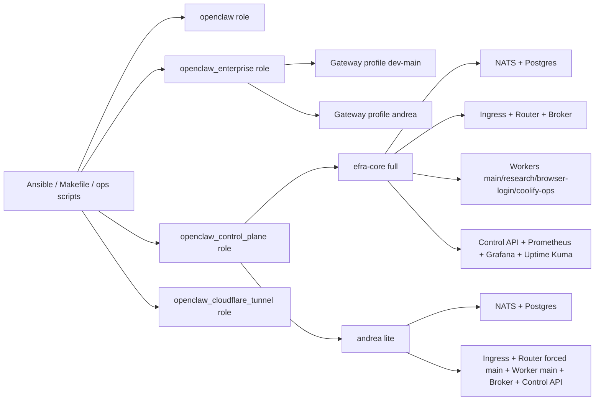
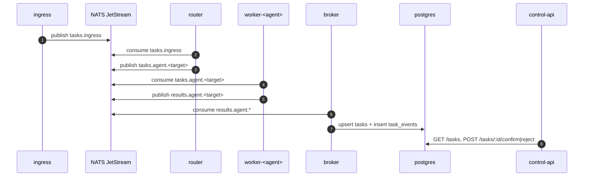

# OpenClaw Ansible Base Protocol

[](https://opensource.org/licenses/MIT)
[](https://github.com/openclaw/openclaw-ansible/actions/workflows/lint.yml)
[](https://www.ansible.com/)
[](https://www.debian.org/)

Base operativa en Ansible para desplegar y operar OpenClaw en modo enterprise, con perfiles múltiples, control-plane Stage 2, sincronización no interactiva de credenciales Codex y flujo de operaciones reproducible.

> Este repositorio **no es el producto OpenClaw final**.
> Es la **capa base de infraestructura/protocolo de despliegue** para instalar, reconciliar, purgar, validar y operar entornos OpenClaw de forma consistente.

## Descripción Corta Sugerida del Repositorio

Si quieres actualizar la descripción en GitHub, puedes usar esta frase:

`Base Ansible para OpenClaw Enterprise + Stage 2 Control Plane (NATS/NestJS), con auth-sync Codex, smoke tests y operación day-2 reproducible.`

## Qué Es y Qué No Es

### Sí es

- Un blueprint de infraestructura para OpenClaw.
- Un conjunto de roles Ansible reutilizables (`openclaw`, `openclaw_enterprise`, `openclaw_control_plane`, `openclaw_cloudflare_tunnel`).
- Un workflow operativo con `Makefile` + `ops/*.sh` para day-0/day-1/day-2.
- Un paquete Stage 2 full/lite para colas, enrutamiento, workers y observabilidad.

### No es

- Una app monolítica única de negocio.
- Un reemplazo del repositorio principal de OpenClaw.
- Un instalador "one-click" sin decisiones operativas: aquí se orquesta infraestructura real con perfiles, secretos y reglas de operación.

## Novedades Relevantes de Esta Base

- Operación estandarizada con `make backup/purge/install/auth-sync/smoke/reinstall`.
- `auth-sync` no interactivo para Codex usando credenciales de `/home/efra/.codex`.
- Stage 2 control-plane en dos modos:
  - `full` (ejemplo: `efra-core`)
  - `lite` (ejemplo: `andrea`)
- Exposición opcional por Cloudflare Tunnel de endpoints locales.
- Documentación de layout instalado con permisos detallados y diagramas Mermaid.
- Endurecimientos recientes en despliegue y control-plane:
  - `ExecStart` directo en systemd (sin wrapper shell innecesario).
  - Healthcheck de control-api alineado con puertos host por modo (`full`/`lite`).
  - UID/GID de workers parametrizado (sin hardcode `994:994`).
  - `confirm/reject` ahora actualiza estado en DB (`needs_confirmation=false`).
  - Escape seguro de contraseña en reconciliación SQL de Postgres.

## Arquitectura (Vista Rápida)



## Flujo de Mensaje (Telegram/API -> Agente -> Resultado)



## Perfiles de Referencia (Inventario `dev`)

Configurados actualmente en `inventories/dev/group_vars/all.yml`:

- Gateway Enterprise:
  - `dev-main` en `127.0.0.1:19011` con agentes `main/research/browser-login/coolify-ops`.
  - `andrea` en `127.0.0.1:19031` con agente `main`.
- Control-plane Stage 2:
  - `efra-core` modo `full` (`ingress=30101`, `control-api=39101`, `grafana=31001`, `prometheus=39091`).
  - `andrea` modo `lite` (`ingress=30111`, `control-api=39111`).

## Operación Recomendada (Day-2)

Desde la raíz del repo:

```bash
make backup
make purge CONFIRM=1
make install
make auth-sync PROFILES="dev-main andrea" OAUTH_PROVIDER=openai-codex
make smoke
```

Ciclo completo en una sola orden:

```bash
make reinstall CONFIRM=1
```

## Targets del Makefile

| Target | Propósito |
|---|---|
| `make backup` | Respalda estado conocido de OpenClaw + control-plane |
| `make purge CONFIRM=1` | Purga estado runtime (destructivo) |
| `make install` | Reconciliación enterprise + control-plane |
| `make secrets-refactor` | Genera archivo manual para migrar/normalizar secretos |
| `make cloudflare` | Reconciliación exclusiva de tunnel/cloudflared |
| `make auth-sync` | Sincroniza credenciales Codex a perfiles/agentes |
| `make oauth-login` | Alias legado de `make auth-sync` |
| `make smoke` | Pruebas de salud y flujo de cola |
| `make reinstall CONFIRM=1` | `backup + purge + install + smoke` |

Variables principales:

- `ENV` (default `dev`)
- `INVENTORY` (default `inventories/<env>/hosts.yml`)
- `LIMIT` (default `zennook`)
- `PROFILES` (default `dev-main andrea`)
- `OAUTH_PROVIDER` (default `openai-codex`)
- `MODEL_REF` (default `openai-codex/gpt-5.3-codex`)

## Auth Sync Codex (No Interactivo)

`ops/auth-sync.sh` realiza este pipeline:

1. Lee credenciales fuente (por defecto):
   - `/home/efra/.codex/auth.json`
   - `/home/efra/.codex/auth-andrea.json`
2. Copia credenciales a:
   - `/home/openclaw/.codex/auth.json`
   - `/home/openclaw/.codex/auth-andrea.json`
3. Escribe `auth-profiles.json` por agente en cada perfil destino.
4. Ajusta modelo por perfil con:
   - `openclaw --profile <perfil> models set <MODEL_REF>`

Sobrescrituras opcionales (cargadas desde `/home/efra/.env` si existe):

- `EFRA_CODEX_HOME`
- `EFRA_CODEX_AUTH_DEFAULT`
- `EFRA_CODEX_AUTH_ANDREA`

## Smoke, Regresión e Idempotencia

### Smoke operativo

`make smoke` valida, entre otros:

- Estado de stacks Docker Compose esperados.
- Endpoints de salud (`/health`) en ingress y control-api.
- Flujo de cola con `/ingress/simulate` hasta estado terminal en control-api.

### Harness de regresión

Existe harness Docker CI en `tests/run-tests.sh` con 3 fases:

1. Convergencia.
2. Verificación.
3. Idempotencia.

Estado observado en ejecución del 2026-03-01:

- Convergencia: `PASS`
- Verificación: `PASS`
- Idempotencia: `FAIL` por 1 cambio en tarea no relacionada a control-plane (`Ensure pnpm directories have correct ownership`).

## Estructura del Repositorio

```text
.
├── playbook.yml                      # instalación base local (role openclaw)
├── playbooks/
│   ├── enterprise.yml                # despliegue enterprise multi-perfil
│   └── control-plane-only.yml        # reconciliación dedicada de control-plane
├── roles/
│   ├── openclaw
│   ├── openclaw_enterprise
│   ├── openclaw_control_plane
│   └── openclaw_cloudflare_tunnel
├── control-plane/                    # servicios NestJS Stage 2
├── inventories/                      # dev/staging/prod/research
├── ops/                              # scripts operativos usados por Makefile
├── docs/                             # runbooks, arquitectura, troubleshooting
└── tests/                            # harness Docker de convergencia/verificación/idempotencia
```

## Seguridad y Permisos

Controles principales que deja esta base:

- Usuario no root para OpenClaw (`openclaw`).
- Secretos por perfil bajo `/etc/openclaw/secrets/*.env`.
- Servicios systemd por perfil de gateway.
- Aislamiento de runtime con Docker para control-plane.
- Endpoints en loopback y exposición opcional por tunnel.

Para layout completo con rutas y permisos (`owner:group` + `mode`), revisa:

- [Installed Runtime Layout](docs/architecture-installed-layout.md)

## Sistemas Operativos Soportados

- Debian
- Ubuntu
- Fedora

### Estado de macOS

La ejecución bare-metal en macOS está deshabilitada en este repo.
El playbook falla explícitamente en `Darwin` para evitar instalación insegura fuera del modelo soportado.

## Documentación Clave

- [Operator Runbook](docs/operator-runbook.md)
- [Operations Workflow](docs/operations-workflow.md)
- [Stage 2 Control Plane](docs/control-plane-stage2.md)
- [Enterprise Deployment](docs/enterprise-deployment.md)
- [Installed Runtime Layout](docs/architecture-installed-layout.md)
- [Cloudflare Tunnel](docs/cloudflare-tunnel.md)
- [Troubleshooting](docs/troubleshooting.md)
- [Configuration Guide](docs/configuration.md)
- [Security Architecture](docs/security.md)
- [Agent Guidelines](AGENTS.md)

## Instalación Manual (Si No Usas Make)

```bash
ansible-galaxy collection install -r requirements.yml
ansible-playbook -i inventories/dev/hosts.yml playbooks/enterprise.yml -l zennook --become
```

Para instalación base local mínima:

```bash
ansible-playbook playbook.yml --become
```

## Licencia

MIT. Ver [LICENSE](LICENSE).

## Referencias

- OpenClaw: https://github.com/openclaw/openclaw
- Issues de esta base: https://github.com/openclaw/openclaw-ansible/issues
