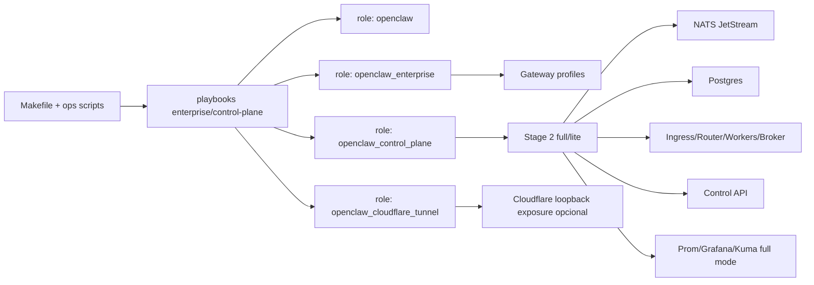
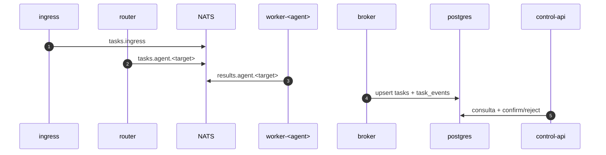

# ClawOps Protocol Suite (Ansible Base)

[](https://opensource.org/licenses/MIT)
[](https://github.com/openclaw/openclaw-ansible/actions/workflows/lint.yml)
[](https://www.ansible.com/)
[](https://www.debian.org/)

Suite operativa para llevar OpenClaw a un estándar de despliegue enterprise: perfiles múltiples, colas Stage 2, auth-sync centralizado, smoke tests y protocolos day-2 reproducibles.

## Por Qué Nace Esta Suite

Nace para resolver un problema operativo concreto: OpenClaw funciona como producto, pero en entornos reales faltaba una capa robusta de infraestructura y protocolo para operar múltiples perfiles y agentes de forma repetible.

Esta suite aparece para cerrar la brecha entre:

- "funciona en una máquina" y "opera estable en equipos/ambientes".
- "instalación manual" y "ciclo completo backup-purge-install-smoke".
- "credenciales dispersas" y "auth-sync controlado por perfil/agente".
- "ejecución sin trazabilidad" y "observabilidad/control con API y eventos".

## Falencias Que Cubre (Frente a Uso Base de OpenClaw)

1. Falta de protocolo multi-perfil/multi-agente: se añade `openclaw_enterprise` y servicios por perfil.
2. Falta de orquestación de colas y control central: se añade Stage 2 (`ingress/router/worker/broker/control-api`) con NATS+Postgres.
3. Falta de sincronización de credenciales a escala: se añade `make auth-sync` con escritura de `auth-profiles.json` por agente.
4. Falta de operación day-2 unificada: se estandariza `make backup/purge/install/smoke/reinstall`.
5. Falta de validación post-despliegue: se añade smoke de salud + flujo de cola terminal.
6. Falta de visibilidad en full mode: se integra Prometheus/Grafana/Uptime Kuma.

## Qué Es y Qué No Es

### Qué es

- Base Ansible de despliegue y operación (protocolo operativo).
- Suite de automatización para OpenClaw en escenarios enterprise.
- Capa de estandarización para equipos DevOps/Platform.

### Qué no es

- No reemplaza el repositorio principal de OpenClaw.
- No es una reescritura del core de OpenClaw.
- No es un instalador "one-click" opaco; es infraestructura explícita y auditable.

## Identidad de la Suite

Nombre operativo recomendado: `ClawOps Protocol Suite`.

Descripción corta recomendada para GitHub:

`Suite Ansible para operación enterprise de OpenClaw con Stage 2 Control Plane (NATS/NestJS), auth-sync Codex, smoke tests y ciclo day-2 reproducible.`

## Arquitectura Rápida



## Flujo Mensajería/Cola



## Operación Recomendada

```bash
make backup
make purge CONFIRM=1
make install
make auth-sync PROFILES="dev-main andrea" OAUTH_PROVIDER=openai-codex
make smoke
```

Ciclo completo:

```bash
make reinstall CONFIRM=1
```

## Targets Operativos

| Target | Propósito |
|---|---|
| `make backup` | Respaldo de estado conocido |
| `make purge CONFIRM=1` | Purga runtime (destructivo) |
| `make install` | Reconciliación enterprise + control-plane |
| `make secrets-refactor` | Genera base de migración de secretos |
| `make cloudflare` | Reconciliación exclusiva del túnel |
| `make auth-sync` | Sincroniza credenciales Codex por perfil/agente |
| `make oauth-login` | Alias legado de auth-sync |
| `make smoke` | Prueba de salud + flujo de cola |
| `make reinstall CONFIRM=1` | Ciclo end-to-end |

Variables clave:

- `ENV`
- `INVENTORY`
- `LIMIT`
- `PROFILES`
- `OAUTH_PROVIDER`
- `MODEL_REF`

## Auth-Sync No Interactivo

`ops/auth-sync.sh`:

1. Lee credenciales fuente (por defecto `/home/efra/.codex/*`).
2. Copia credenciales a `/home/openclaw/.codex`.
3. Escribe `auth-profiles.json` por agente en perfiles destino.
4. Fija modelo por perfil con `openclaw --profile <name> models set <MODEL_REF>`.

Overrides vía `/home/efra/.env`:

- `EFRA_CODEX_HOME`
- `EFRA_CODEX_AUTH_DEFAULT`
- `EFRA_CODEX_AUTH_ANDREA`

## Pruebas y Calidad Operativa

- `make smoke`: salud ingress/control-api + simulación de cola hasta estado terminal.
- `tests/run-tests.sh`: convergencia/verificación/idempotencia en harness Docker.
- `ansible-playbook --syntax-check`: validación de sintaxis de playbooks.

## Estructura del Repo

```text
.
├── playbook.yml
├── playbooks/
├── roles/
├── control-plane/
├── inventories/
├── ops/
├── docs/
└── tests/
```

## Nota Legal Importante (MIT)

Sí se puede modificar gran parte del repositorio, documentación y branding.

Pero **no** se debe eliminar el cumplimiento de licencia MIT en copias sustanciales del software. En la práctica, eso implica mantener los avisos de licencia/copyright aplicables en los artefactos distribuidos.

Por eso, se puede crear identidad propia de suite, pero no borrar obligaciones legales de atribución/licencia.

## Compatibilidad y SO

- Debian
- Ubuntu
- Fedora

macOS bare-metal está bloqueado en este repo por política de seguridad operativa.

## Documentación Principal

- [Architecture](docs/architecture.md)
- [Enterprise Deployment](docs/enterprise-deployment.md)
- [Operations Workflow](docs/operations-workflow.md)
- [Operator Runbook](docs/operator-runbook.md)
- [Stage 2 Control Plane](docs/control-plane-stage2.md)
- [Installed Runtime Layout](docs/architecture-installed-layout.md)
- [Cloudflare Tunnel](docs/cloudflare-tunnel.md)
- [Troubleshooting](docs/troubleshooting.md)

## Licencia

MIT. Ver [LICENSE](LICENSE).
