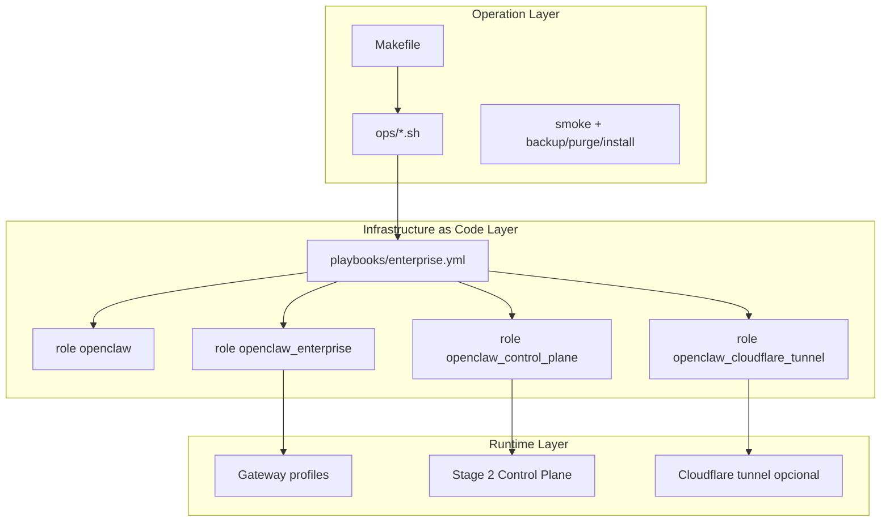
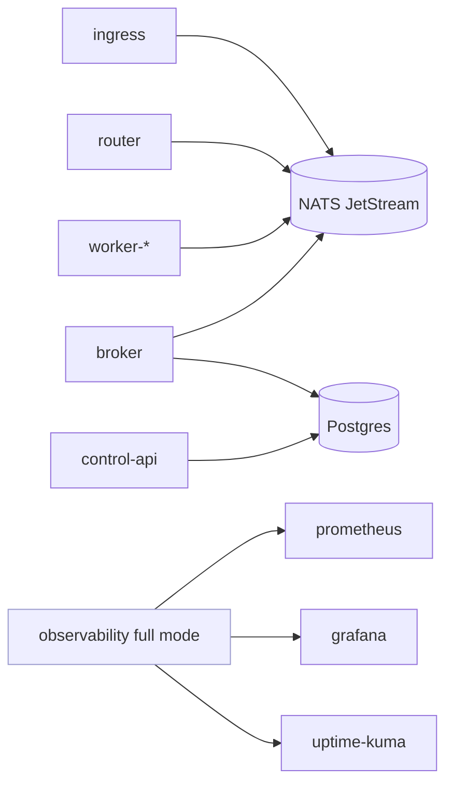

# ClawOps Suite Architecture

## Objetivo Arquitectónico

Separar claramente tres capas:

1. Capa producto (OpenClaw runtime).
2. Capa plataforma (Ansible roles/playbooks).
3. Capa operación (Makefile + `ops/*.sh` + smoke/runbooks).

Esta separación permite operación reproducible y control de drift en entornos reales.

## Mapa de Componentes

## Stage 2 Runtime (Full/Lite)

## Falencias Cubiertas por Diseño

| Falencia operativa | Respuesta en la suite |
|---|---|
| Instalación no repetible | Playbooks + defaults + inventarios por ambiente |
| Drift entre perfiles/agentes | Perfiles declarativos + reconciliación Ansible |
| Sin control de cola/estado | NATS + broker + control-api + PostgreSQL |
| Confirmaciones sin transición persistida | `control-api` actualiza estado y eventos en DB |
| Credenciales manuales por agente | `auth-sync` no interactivo por perfil/agente |
| Day-2 artesanal | Targets `make` estandarizados |

## Seguridad Operativa

- Secrets por perfil en `/etc/openclaw/secrets/*.env`.
- Servicios con aislamiento de usuario/perfil.
- Endpoints internos en loopback (publicación externa opcional por tunnel).
- Workers con UID/GID parametrizados para evitar supuestos rígidos de host.

## Rutas Críticas

- Playbook enterprise: `playbooks/enterprise.yml`
- Roles: `roles/openclaw*`
- Control-plane source: `control-plane/`
- Inventarios: `inventories/*`
- Operación: `ops/*`, `Makefile`

## Decisión de Compatibilidad

macOS bare-metal se considera fuera del modelo de ejecución seguro/soportado para esta suite.

## Relación con OpenClaw

Esta suite es una capa de protocolo y operación sobre OpenClaw; no reemplaza el producto.
