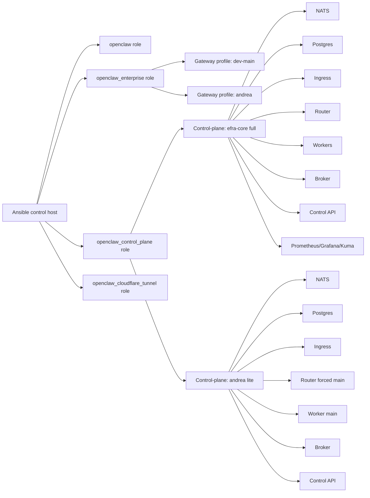
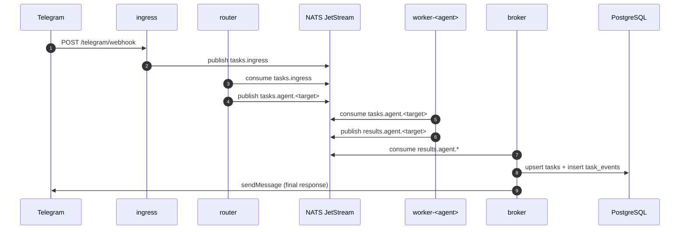
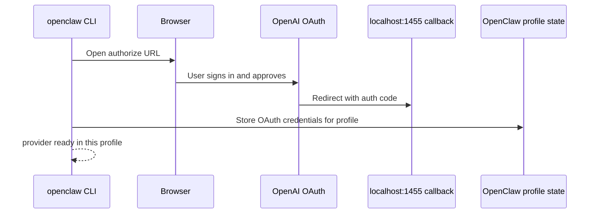

# Operator Runbook

This runbook is the canonical step-by-step guide to:

- Install and reconcile OpenClaw with Ansible.
- Operate multi-profile gateways (`dev-main`, `andrea`, and new profiles).
- Operate Stage 2 control-plane (`full` and `lite`).
- Login providers (OpenAI Codex OAuth) per profile.
- Create new profiles and new agents safely.
- Route Telegram traffic to agents and validate queue execution.

Use this with:

- [Enterprise Deployment](enterprise-deployment.md)
- [Stage 2 Control Plane](control-plane-stage2.md)
- [Operations Workflow](operations-workflow.md)
- [Troubleshooting](troubleshooting.md)

## 1. Architecture and Responsibilities

### 1.1 Logical topology



### 1.2 Message flow (Telegram to agent and back)



### 1.3 Component map in this repository

- Enterprise playbook: `playbooks/enterprise.yml`
- Gateway profile role: `roles/openclaw_enterprise`
- Control-plane role: `roles/openclaw_control_plane`
- Stage 2 source code: `control-plane/`
- Environment inventory: `inventories/dev/group_vars/all.yml`

## 2. Prerequisites

- Supported OS on target nodes: Debian, Ubuntu, Fedora.
- Sudo privileges on target node(s).
- `ansible`, `git`, `python3`.
- Telegram Bot token(s) in Vault or inventory variables.
- OpenClaw gateway token per profile (`OPENCLAW_GATEWAY_TOKEN`).

Optional:

- Cloudflare tunnel credentials for remote subdomains.
- Tailscale enabled on target nodes.

## 3. Full Install / Reconcile from Zero

The recommended operator path is Makefile + `ops/*.sh`.

```bash
cd /home/efra/openclaw-ansible

# 1) Backup current runtime
make backup ENV=dev LIMIT=zennook

# 2) Purge runtime (explicit confirmation required)
make purge CONFIRM=1 ENV=dev LIMIT=zennook

# 3) Deploy enterprise profiles + control-plane
make install ENV=dev LIMIT=zennook

# 4) Optional Cloudflare reconcile
make cloudflare ENV=dev LIMIT=zennook

# 5) OAuth login (interactive browser flow)
make oauth-login ENV=dev LIMIT=zennook PROFILES="dev-main andrea" OAUTH_PROVIDER=openai-codex

# 6) Run smoke tests
make smoke ENV=dev LIMIT=zennook
```

Equivalent direct Ansible command:

```bash
ansible-playbook -i inventories/dev/hosts.yml playbooks/enterprise.yml --ask-become-pass --limit zennook
```

## 4. Provider Login (OpenAI Codex OAuth)

### 4.1 Why OAuth per profile

Auth state is profile-specific (`--profile <name>`).  
If you run multiple profiles, log in once for each profile.

### 4.2 Standard login command

```bash
sudo -u openclaw -H /home/openclaw/.local/bin/openclaw --profile dev-main models auth login --provider openai-codex
sudo -u openclaw -H /home/openclaw/.local/bin/openclaw --profile andrea   models auth login --provider openai-codex
```

### 4.3 OAuth flow details



### 4.4 Verify login

```bash
sudo -u openclaw -H /home/openclaw/.local/bin/openclaw --profile dev-main status --all
sudo -u openclaw -H /home/openclaw/.local/bin/openclaw --profile dev-main models list
```

## 5. Create a New Profile (Gateway + Optional Control-Plane)

This section describes the exact files and steps.

### 5.1 Add gateway profile to inventory

Edit `inventories/dev/group_vars/all.yml` and add an item under `openclaw_enterprise_profiles`:

```yaml
- name: ops-lab
  gateway_port: 19041
  gateway_bind: loopback
  state_dir: /home/openclaw/.openclaw-ops-lab
  config_path: /home/openclaw/.openclaw-ops-lab/openclaw.json
  workspace_root: /home/openclaw/.openclaw-ops-lab/workspace
  model_primary: openai/gpt-5-mini
  model_fallbacks:
    - anthropic/claude-sonnet-4-5
  tools_profile: coding
  sandbox_mode: non-main
  sandbox_scope: session
  agents:
    - id: main
      default: true
      workspace: /home/openclaw/.openclaw-ops-lab/workspace
  env:
    OPENCLAW_GATEWAY_TOKEN: "{{ vault_openclaw_gateway_token_ops_lab }}"
    OPENAI_API_KEY: ""
    ANTHROPIC_API_KEY: ""
```

### 5.2 Add secrets in Vault

Edit `inventories/dev/group_vars/vault.yml`:

```yaml
vault_openclaw_gateway_token_ops_lab: "replace-with-strong-random-token"
```

Encrypt if needed:

```bash
ansible-vault encrypt inventories/dev/group_vars/vault.yml
```

### 5.3 (Optional) Add control-plane profile for this gateway profile

Under `openclaw_control_plane_profiles`:

```yaml
- name: ops-lab
  mode: lite
  gateway_profile: ops-lab
  project_dir: /home/efra/openclaw-control-plane/ops-lab
  ingress_port: 30121
  control_api_port: 39121
  telegram_bot_token: "{{ vault_telegram_bot_token_ops_lab }}"
  telegram_default_chat_id: "{{ vault_telegram_default_chat_id_ops_lab }}"
  postgres_password: "{{ vault_openclaw_cp_postgres_password_ops_lab }}"
  nats_user: queue
  nats_password: "{{ vault_openclaw_cp_nats_password_ops_lab }}"
```

Vault keys:

```yaml
vault_telegram_bot_token_ops_lab: ""
vault_telegram_default_chat_id_ops_lab: ""
vault_openclaw_cp_postgres_password_ops_lab: "replace"
vault_openclaw_cp_nats_password_ops_lab: "replace"
```

### 5.4 Deploy and verify

```bash
make install ENV=dev LIMIT=zennook
sudo -u openclaw -H /home/openclaw/.local/bin/openclaw --profile ops-lab status --all
```

### 5.5 Login provider for new profile

```bash
sudo -u openclaw -H /home/openclaw/.local/bin/openclaw --profile ops-lab models auth login --provider openai-codex
```

## 6. Create a New Agent Inside an Existing Profile

### 6.1 Add agent in inventory profile

Inside the profile `agents:` list in `inventories/dev/group_vars/all.yml`:

```yaml
- id: qa
  workspace: /home/openclaw/.openclaw-dev-main/workspace-qa
  tools:
    profile: coding
```

Redeploy:

```bash
make install ENV=dev LIMIT=zennook
```

### 6.2 Create identity/memory files for the new agent workspace

```bash
sudo -u openclaw -H install -d -m 700 /home/openclaw/.openclaw-dev-main/workspace-qa/memory

sudo -u openclaw -H bash -lc 'cat > /home/openclaw/.openclaw-dev-main/workspace-qa/IDENTITY.md <<EOF
# QA Agent
Nombre: Efra QA
Rol: validacion funcional, regresiones, checklist de release.
EOF'

sudo -u openclaw -H bash -lc 'cat > /home/openclaw/.openclaw-dev-main/workspace-qa/MEMORY.md <<EOF
# Long-term Memory
- Mantener foco en pruebas repetibles y evidencia.
EOF'

sudo -u openclaw -H bash -lc 'cat > /home/openclaw/.openclaw-dev-main/workspace-qa/AGENTS.md <<EOF
# Agent Rules
- No ejecutar acciones destructivas sin confirmacion explicita.
EOF'
```

Optional additional files:

- `SOUL.md`
- `TOOLS.md`
- `USER.md`
- `HEARTBEAT.md`
- `memory/YYYY-MM-DD.md`

### 6.3 Validate agent registration

```bash
sudo -u openclaw -H /home/openclaw/.local/bin/openclaw --profile dev-main agents list --json
```

### 6.4 Route traffic to new agent

If needed, add routing logic in `control-plane/src/common/intents.ts` and redeploy control-plane.

## 7. Telegram Commands and Agent Routing

### 7.1 Supported operational commands

- `/agents`: returns the list of available agents and intents (direct response from ingress).
- Normal text: gets queued and routed by intent classifier.

### 7.2 Intent to agent mapping

Current classifier rules in `control-plane/src/common/intents.ts`:

- `browser.login` -> `browser-login` keywords: `login`, `browser`, `portal`, `cookie`, `captcha`
- `deploy.coolify` -> `coolify-ops` keywords: `coolify`, `deploy`, `release`, `rollback`, `service up`, `service down`
- `research.analysis` -> `research` keywords: `investiga`, `analiza`, `research`, `comparar`, `resumen`, `benchmark`
- fallback -> `main`

### 7.3 Browser-login worker networking note

For browser workflows, `worker-browser-login` uses host networking in full mode template:

- `network_mode: host`
- `shm_size: "1gb"`
- `NATS_URL` override to loopback-published NATS (`127.0.0.1:14222`)

This avoids hanging tasks when browser automation needs host-level gateway/browser relay access.

## 8. Daily Command Reference (Per Profile)

Replace `<profile>` with `dev-main`, `andrea`, or your custom profile.

### 8.1 Health and status

```bash
sudo -u openclaw -H /home/openclaw/.local/bin/openclaw --profile <profile> status --all
sudo -u openclaw -H /home/openclaw/.local/bin/openclaw --profile <profile> doctor --fix
sudo -u openclaw -H /home/openclaw/.local/bin/openclaw --profile <profile> security audit --deep
```

### 8.2 Gateway lifecycle

```bash
sudo -u openclaw -H /home/openclaw/.local/bin/openclaw --profile <profile> gateway status
sudo -u openclaw -H /home/openclaw/.local/bin/openclaw --profile <profile> gateway stop
sudo -u openclaw -H /home/openclaw/.local/bin/openclaw --profile <profile> gateway start
```

### 8.3 Agent command execution

```bash
sudo -u openclaw -H /home/openclaw/.local/bin/openclaw --profile <profile> agent --agent main --message "hola" --json
sudo -u openclaw -H /home/openclaw/.local/bin/openclaw --profile <profile> agent --agent research --message "investiga X" --json
```

### 8.4 Onboarding

```bash
sudo -u openclaw -H /home/openclaw/.local/bin/openclaw --profile <profile> onboard --install-daemon
```

## 9. Stage 2 Validation Checklist

```bash
# service health
curl -fsS http://127.0.0.1:30101/health
curl -fsS http://127.0.0.1:39101/health

# queue stats
curl -fsS http://127.0.0.1:39101/queues

# simulate ingress
curl -fsS -X POST http://127.0.0.1:30101/ingress/simulate \
  -H "content-type: application/json" \
  -d '{"text":"investiga como te llamas y cual es tu labor","chatId":"local-sim"}'
```

Telegram E2E checklist:

1. Send `/agents` and verify catalog.
2. Send `investiga ...` and verify `[agent=research]`.
3. Send `login ...` and verify `[agent=browser-login]`.
4. Send `coolify deploy ...` and verify `[agent=coolify-ops]`.
5. Send generic `hola` and verify `[agent=main]`.

## 10. Troubleshooting Matrix

### 10.1 Missing gateway token

Symptom:

- `MissingEnvVarError: Missing env var "OPENCLAW_GATEWAY_TOKEN"`

Actions:

1. Check profile env file exists:
   - `/etc/openclaw/secrets/<profile>.env`
2. Confirm token is present.
3. Re-run:
   - `openclaw --profile <profile> doctor --fix`

### 10.2 Wrong sudo syntax

Symptom:

- `sudo: unrecognized option '--profile'`

Cause:

- `--profile` belongs to `openclaw`, not `sudo`.

Correct:

```bash
sudo -u openclaw -H /home/openclaw/.local/bin/openclaw --profile dev-main doctor --fix
```

### 10.3 OAuth command says no provider plugins found

Action:

1. Ensure correct OpenClaw install/profile.
2. Ensure bundled plugins path exists:
   - `/home/openclaw/.openclaw/bundled-extensions`
3. Prefer onboarding wizard for first-time provider setup if plugin state is inconsistent.

### 10.4 Browser task hangs or no Telegram response

Actions:

1. Check worker backlog in NATS (`num_ack_pending` / `num_pending`).
2. Ensure `worker-browser-login` has host networking in full stack template.
3. Ensure browser relay is attached (`tabs > 0`) before screenshot/login tasks.

### 10.5 Shell completion missing file

Symptom:

- `bash: .../completions/openclaw.bash: No existe ...`

Actions:

1. `openclaw --profile <profile> doctor --fix`
2. If needed, create completion directory/file and fix ownership.

## 11. Safe Change Process (Recommended)

When adding profiles/agents:

1. Update inventory + Vault.
2. `make install`.
3. Run OAuth login for target profiles.
4. Run smoke checks.
5. Validate Telegram E2E.
6. Commit changes with docs + inventory + role/template updates together.

This keeps code, runtime behavior, and operational docs aligned.
